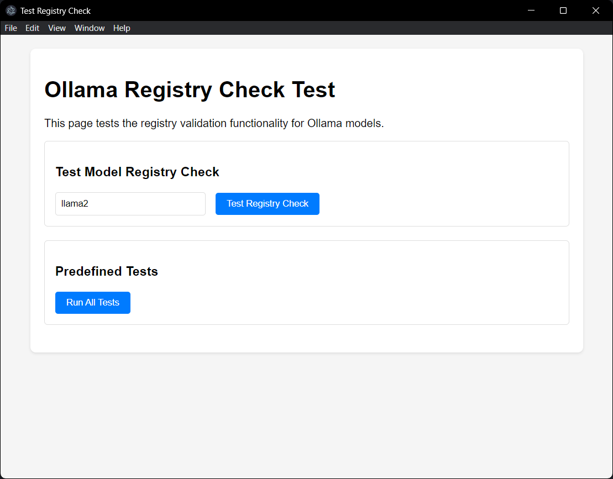

# Electron Registry Check

A utility application built with Electron to check and manage Windows registry settings.

## Features

- Check Windows registry values
- Simple and intuitive interface
- Cross-platform support (Windows)

## Prerequisites

- Node.js (v14 or higher)
- npm (v6 or higher)
- Git (optional, for development)

## Installation

1. Clone the repository:
   ```bash
   git clone https://github.com/FalloutGhoulBusta/Ollama-RegCheck.git
   cd Ollama-RegCheck
   ```

2. Install dependencies:
   ```bash
   npm install
   ```

## Usage

To start the application in development mode:

```bash
npm start
```

## Screenshot



> Note: Add your application screenshot and name it `screenshot.png` in the screenshot folder.

## Development

### Project Structure

- `main.js` - Main Electron process file
- `test-registry-check.html` - Test page for registry check functionality

### Building for Production

To create a production build:

```bash
npm run package
```

## Contributing

Contributions are welcome! Please read our [Contributing Guidelines](CONTRIBUTING.md) for details on our code of conduct and the process for submitting pull requests.

## License

This project is licensed under the MIT License - see the [LICENSE](LICENSE) file for details.

⠀⠀⠀⠀⠀⢀⠠⠐⠉⠁⠂⠄⡀⠀⠀⠀⠀⠀⠀⠀⠀⠀⠀⠀⠀⠀⠀⠀⠀⠀⠀⠀⠀⠀⠀⠀⠀⠀⠀⠀⠀⠀⠀⠀⠀⠀⠀⠀⠀⠀
⠀⠀⠀⠀⠀⢸⡍⠒⠤⣀⠀⣀⣤⣿⠀⠀⡀⠀⠀⠀⠀⠀⠀⠀⠀⠀⠀⠀⠀⠀⠀⠀⠀⠀⠀⠀⠀⠀⠀⠀⠀⠀⠀⠀⠀⠀⠀⠀⠀⠀
⠀⠀⠀⠀⠀⢸⡄⢹⣦⠀⣿⣿⣿⣟⠒⠉⠀⠁⠂⠄⡀⠀⠀⠀⠀⠀⠀⠀⠀⠀⠀⠀⠀⠀⠀⠀⠀⠀⠀⠀⠀⠀⠀⠀⠀⠀⠀⠀⠀⠀
⠀⠀⠀⠀⢀⠼⠧⣘⠻⠂⣿⣿⣾⣇⢁⠒⠤⣀⣀⣴⣞⡇⠀⠀⠀⠀⠀⠀⠀⠀⠀⠀⠀⠀⠀⠀⠀⠀⠀⠀⠀⠀⠀⠀⠀⠀⠀⠀⠀⠀
⠀⠀⢰⠯⣀⠀⠀⠀⠉⠒⠿⠛⠁⢸⠸⣷⡆⢸⣿⣿⡏⠂⠄⡀⠀⠀⠀⠀⠀⠀⠀⠀⠀⠀⠀⠀⠀⠀⠀⠀⠀⠀⠀⠀⠀⠀⠀⠀⠀⠀
⠀⠀⢸⠸⣆⠉⠶⣀⠀⠀⠀⠀⠀⠸⣀⡉⠇⢸⣿⣏⡷⢀⣰⣾⠀⠀⠀⠀⠀⠀⠀⣀⠶⢆⠀⠀⠀⠀⠀⠀⠀⠀⠀⠀⠀⠀⠀⠀⠀⠀
⠀⠀⢸⠐⢼⡷⣶⡄⠉⠒⠤⢀⠀⠀⠀⠉⠓⢼⣿⣟⣿⡿⣿⣿⠀⠀⠀⣀⠤⠒⠉⠀⠀⠀⠈⠐⠠⢀⠀⠀⠀⠀⠀⠀⠀⠀⠀⠀⠀⠀
⠀⠀⣸⠤⠚⠋⠉⠓⠤⣀⣷⣤⣉⠒⢤⣴⣾⣿⣟⣿⢾⣟⣿⣽⠤⠒⠁⠀⠀⠀⠀⠀⠀⠀⠀⠀⠀⠀⠈⠐⠠⢄⠀⠀⠀⠀⠀⠀⠀⠀
⢖⠈⠀⠀⠀⠀⠀⠀⠀⠀⠉⣺⣯⡇⠸⣿⣟⣾⣟⣾⣟⣿⣾⡷⠀⠀⠀⠀⠀⠀⠀⠀⠀⠀⠀⠀⠀⠀⠀⠀⠀⠀⠈⠐⠠⢀⡀⠀⠀⠀
⣆⡉⠒⠤⣀⠀⠀⣀⣤⣶⣿⣿⠿⡇⢘⣿⣯⣷⣿⣻⣾⡷⣿⡟⠀⠀⠀⠀⠀⠀⠀⠀⠀⠀⠀⠀⠀⠀⠀⠀⠀⠀⠀⠀⠀⠀⠀⠐⠠⠀
⠻⣏⠀⠀⣠⣉⣿⣿⣟⣿⡷⣿⠀⠀⢸⣯⣿⢷⣿⣻⣾⢿⣟⣟⠀⠀⠀⠀⠀⠀⠀⠀⠀⠀⠀⠀⠀⠀⠀⠀⠀⠀⠀⠀⠀⠀⠀⣀⣠⣶
⣧⣼⣻⢳⡼⢿⣿⣷⣻⣯⣿⣿⠀⠂⢸⣿⣯⣿⣿⣻⣽⣿⣿⣏⠀⠀⠀⠀⠀⠀⠀⠀⠀⠀⠀⠀⠀⠀⠀⠀⠀⠀⠀⢀⣤⣴⣿⣿⣿⣿
⠻⠟⣿⣿⣧⣤⣿⣿⣯⡿⠗⠋⠀⠄⢸⣿⣯⣷⡿⣟⣯⣷⣿⡧⠀⠀⠀⠀⠀⠀⠀⠀⠀⠀⠀⠀⠀⠀⠀⣀⣠⣶⣾⣿⣿⡿⣟⣿⣾⣿
⠀⠀⢸⢈⠙⠻⠟⠋⠁⡀⠄⡈⠐⡈⢸⣿⡿⣽⣿⡿⣟⣿⣽⡟⠀⠀⠀⠀⠀⠀⠀⠀⠀⠀⠀⢀⣤⣴⣿⣿⣿⣿⣻⣿⣽⣿⡿⣿⣻⣽
⠀⠀⢸⢈⠐⠠⢂⢈⠡⠐⠠⠌⠁⠄⢸⣿⣿⢿⣯⣿⣿⢿⣻⣟⠀⠀⠀⠀⠀⠀⠀⣀⣠⣶⣿⣿⣿⢿⣻⣽⣾⣟⣿⣽⣿⣾⣿⣿⣿⣿
⠀⠀⢸⠀⡌⢑⠠⢠⠘⡀⠡⢀⢃⠂⢸⣿⡿⣿⣿⣷⣿⡿⠟⠋⠀⠀⠀⢀⣤⣴⣿⣿⡿⣟⣯⣿⣻⣿⢿⣻⣽⣿⣻⣯⣷⣿⣷⣿⣯⣿
⠀⠀⢸⠀⡜⠠⢂⠄⢣⠀⢡⠂⠆⠌⢸⣿⣿⢿⣷⣿⣯⠐⠤⣀⣠⣶⣿⣿⡿⣿⣻⣷⣿⢿⣿⣻⣿⣽⣿⡿⣿⣽⣿⣟⣿⣽⣾⣿⣿⣿
⠀⠀⢸⠠⡔⠡⢈⠢⢄⠘⣀⠊⡐⢈⢸⣿⡿⣿⣟⣿⡷⠀⠠⢸⣿⣿⣯⣷⣿⡿⣿⣽⣾⡿⣟⣿⣽⣿⣾⢿⣟⣿⣽⣿⡿⣿⣻⣿⣿⣿
⠀⠀⢸⠰⢆⠁⡆⠶⡈⠰⠀⡆⢱⠀⢸⣿⣿⣿⢿⣿⡿⢀⠰⢸⣿⣷⣿⣏⣷⣿⣿⢿⣹⣿⣿⡿⣿⣾⣿⣿⣿⢿⣏⣿⣿⣿⣿⣿⣿⣿
⠀⠀⢸⢐⠃⡌⡐⠦⣡⠑⡌⡐⣂⠡⢸⣿⣿⡿⣿⣿⣟⠠⢀⢸⣿⡿⣷⣿⢿⣯⣿⡿⣿⣻⣷⣿⣿⣻⣾⣿⣽⣿⡿⣿⣻⣿⣿⣿⢿⠻
⠀⠀⢸⢌⢊⠔⡡⢒⠤⢃⠤⡑⠤⠃⢼⣿⣿⣿⣿⢿⣯⠀⠤⢸⣿⣿⣟⣿⡿⣟⣷⣿⣿⢿⣯⣷⣿⣟⣿⣾⣿⣟⣿⣿⣿⣿⡟⠂⠁⠀
⠀⠀⠈⠛⠢⢎⡐⢣⢘⠢⡑⠬⣁⠏⣸⣿⣿⣿⣾⣿⣿⠀⡐⢸⣿⣷⣿⣻⣿⡿⣿⣻⣾⣿⣿⣻⣽⣿⣿⣽⣾⣿⣿⣻⣽⣾⡇⠀⠀⠀
⠀⠀⠀⠀⠀⠀⠉⢱⠎⠰⣉⠲⣁⠚⣸⣿⣿⣿⣿⣿⠟⠠⠐⢸⣿⣯⣿⢿⣷⣿⡿⣿⣻⣷⣿⣿⡿⠗⠋⡁⢸⣿⣽⡿⣟⣿⡇⠀⠀⠀
⠀⠀⠀⠀⠀⠀⠀⢨⢳⠀⡈⠙⠒⠭⣸⣿⠿⠛⢁⠰⡀⢆⠉⢼⣿⣟⣿⣿⣻⣷⣿⣿⢿⣿⣿⠁⠀⡐⠠⠐⢸⣿⣿⢿⣿⡿⣇⠀⠀⠀
⠀⠀⠀⠀⠀⠀⠀⠐⣏⠐⠠⠁⠌⡐⣿⣿⣶⣮⡄⣣⠑⢤⣉⢺⣿⣿⣿⣿⡿⣿⣽⣾⣿⡿⣿⠠⢁⠠⢡⠈⢸⣿⣿⣿⣯⣿⡇⠀⠀⠀
⠀⠀⠀⠀⠀⠀⠀⢘⡒⠠⠄⡉⠐⡀⣿⣿⡿⣿⡇⠀⠙⠓⢤⣺⣿⣿⣾⢿⣽⡿⣿⣿⣿⣿⣿⠐⠠⢁⠂⢌⢸⣿⣿⣾⣿⣽⡇⠀⠀⠀
⠀⠀⠀⠀⠀⠀⠀⠠⢇⡁⢂⠡⠡⠐⣿⣿⣿⢿⡇⠈⡐⠈⠄⠠⢸⣿⡿⣿⣻⣿⣿⣿⣿⣻⣿⠀⡑⠂⠌⡐⢸⣿⣿⣷⡿⣿⡇⠀⠀⠀
⠀⠀⠀⠀⠀⠀⠀⠘⣆⠐⠢⢀⠱⢈⣿⣿⡿⣿⡇⡐⠠⠡⠈⠄⢻⣿⣿⢿⣿⣷⣿⣿⣿⣿⣿⠠⢌⡑⠠⡐⢸⣿⣿⣯⣿⣿⡇⠀⠀⠀
⠀⠀⠀⠀⠀⠀⠀⠘⣶⠈⢡⠂⡐⠠⣿⣿⣿⣿⡇⠤⢁⠢⢁⠌⣸⣿⣿⣿⣻⣾⣿⣿⣿⣿⣿⠐⠢⢌⠑⠤⢹⣿⣿⣿⣟⣿⡇⠀⠀⠀
⠀⠀⠀⠀⠀⠀⠀⠘⡦⢘⢢⠐⣈⠡⣿⣿⣿⣾⡇⠒⠠⢈⠂⡐⢼⣿⣿⣾⢿⣟⡿⠟⠚⠁⢸⢊⠡⢌⠚⡠⢺⣿⣿⣿⣿⣿⡇⠀⠀⠀
⠀⠀⠀⠀⠀⠀⠀⢘⡵⢈⢂⡱⣀⠒⣿⣿⣿⣿⡇⠈⡅⢂⠂⠡⢺⣿⣿⣽⣿⣿⡇⠀⠀⠀⢸⠇⣘⠢⣡⠑⣼⣿⣿⣿⣿⣿⢧⠀⠀⠀
⠀⠀⠀⠀⠀⠀⠀⢸⣹⠀⢇⠰⣀⠎⣿⣿⣿⣿⡇⢰⠈⠆⡈⠁⣾⣿⣿⣿⣹⣿⡇⠀⠀⠀⠀⠈⠷⢶⡀⢇⢸⣿⣿⢿⠷⠏⠁⠀⠀⠀
⠀⠀⠀⠀⠀⠀⠀⠘⢮⡘⡄⠓⣄⢊⣿⣿⣿⣿⡇⢂⢍⡒⢠⠑⣸⣿⣿⣿⢿⣻⡇⠀⠀⠀⠀⠀⠀⠀⠈⠓⠸⠛⠉⠀⠀⠀⠀⠀⠀⠀
⠀⠀⠀⠀⠀⠀⠀⠀⠀⠀⠉⠳⠤⣊⣿⡿⠟⠉⡇⡌⢄⠒⢢⠁⢾⣿⣿⣿⣿⣿⡇⠀⠀⠀⠀⠀⠀⠀⠀⠀⠀⠀⠀⠀⠀⠀⠀⠀⠀⠀
⠀⠀⠀⠀⠀⠀⠀⠀⠀⠀⠀⠀⠀⠈⠁⠀⠀⠀⡗⠣⢌⡸⠡⠜⣸⣿⣿⣿⣿⣽⡇⠀⠀⠀⠀⠀⠀⠀⠀⠀⠀⠀⠀⠀⠀⠀⠀⠀⠀⠀
⠀⠀⠀⠀⠀⠀⠀⠀⠀⠀⠀⠀⠀⠀⠀⠀⠀⠀⠉⠳⠦⣐⠣⠌⣽⣿⣿⣿⠯⠛⠁⠀⠀⠀⠀⠀⠀⠀⠀⠀⠀⠀⠀⠀⠀⠀⠀⠀⠀⠀
⠀⠀⠀⠀⠀⠀⠀⠀⠀⠀⠀⠀⠀⠀⠀⠀⠀⠀⠀⠀⠀⠈⠉⠚⠼⠛⠉⠀⠀⠀⠀⠀⠀⠀⠀⠀⠀⠀⠀⠀⠀⠀⠀⠀⠀⠀⠀⠀⠀⠀
